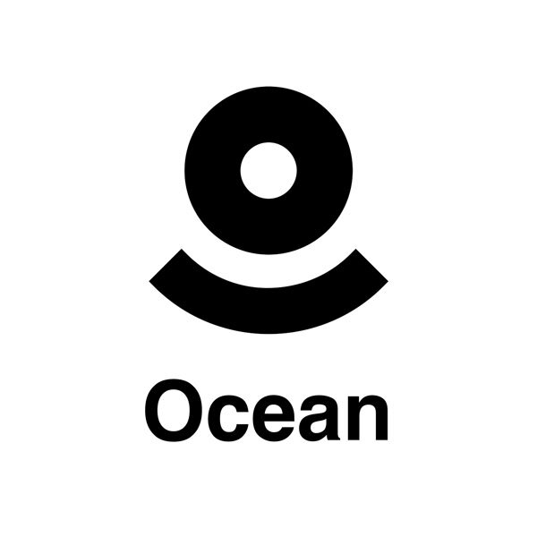

# Ocean

A full-stack web application enabling company-wide documentation management for 4+ cross-functional teams including leadership, recruiting, engineering, and partnerships. [Live Link](https://bit.ly/ocean-notes)<br/>
<br/>

<br/>

### Functionality
- Notion-style editor 📝 
- File upload, deletion, replacement 📄
- Infinite children documents 🌲
- Trash can & soft delete 🗑️


### Demo

1. Sign In

<br/>

2. Conversation Generation

<br/>

3. Music Generation

<br/>

4. Image Generation

<br/>

5. Video Generation

<br/>


6. Code Generation

<br/>

7. Upgrade to Pro

<br/>

### System Design
<br/>


### Technologies Used

- TypeScript
- React
- Next.js
- Prisma
- Convex 
- EdgeStore 

### How to Run Locally

Step 1 - Clone the repository in a new directory:
```bash
git clone git@github.com:ZohaibManzoor00/Ocean.git
```

Step 2 - Create .env file in root directory with the following info:
```bash
# Clerk with Next.js. Docs (clerk.com/docs/quickstarts/nextjs)
NEXT_PUBLIC_CONVEX_URL=

EDGE_STORE_ACCESS_KEY=
EDGE_STORE_SECRET_KEY=

NEXT_PUBLIC_CLERK_PUBLISHABLE_KEY=
CLERK_SECRET_KEY=
```

Step 3 - Install Dependencies
```bash
npm i 
```

Step 4 - Setup Convex
```bash
npx convex dev
```

Step 5 - Run app locally
```bash
npm run dev
```
