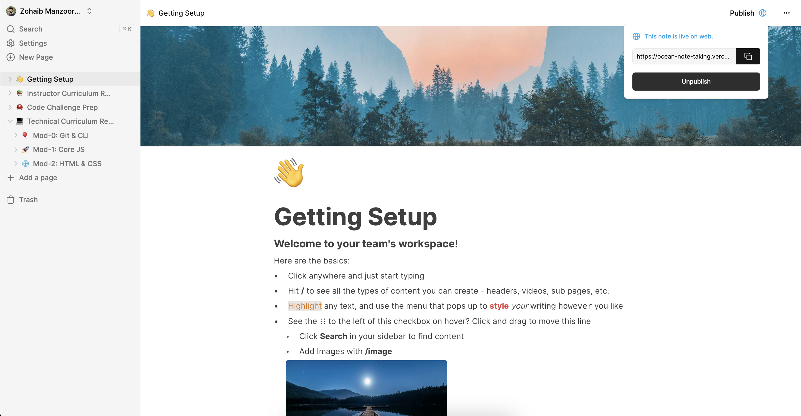
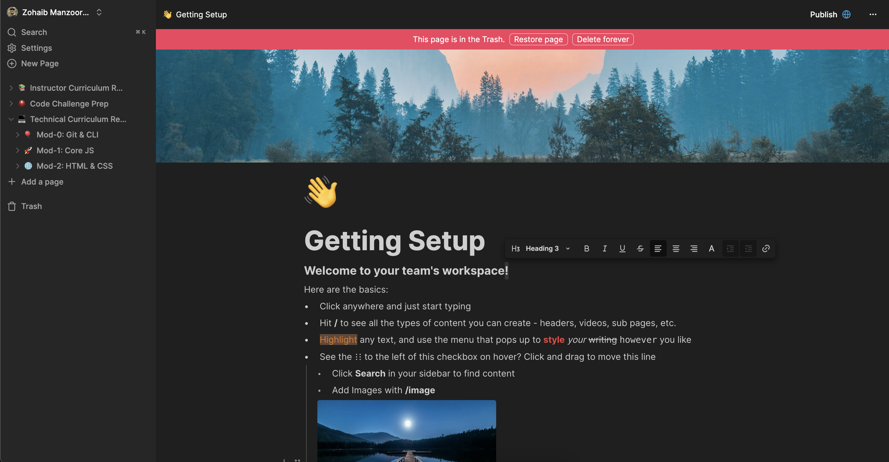

# 🌊 Ocean

A full-stack web application enabling company-wide documentation management for 4+ cross-functional teams including leadership, recruiting, engineering, and partnerships. Tech Stack - TypeScript, React, Next.js, Prisma, and Convex.

> 🔗 [Ocean Live!](https://ocean-note-taking.vercel.app)

<br/>

## 🚀 Features
- 📝 **Notion-style Editor** - Streamlined document creation and editing.
- 📄 **File Management** - Seamless uploads, deletions, and replacements.
- 🌲 **Infinite Document Nesting** - Effortlessly organize with a hierarchical structure.
- 🗑️ **Advanced Deletion** - Smart trash can and soft delete capabilities.
- 🔗 **Real-time Database** - Instant data synchronization.
- 🌓 **Light and Dark Modes** - Customizable viewing preferences.
- 🔐 **Secure Authentication** - Robust security for user access.
- 🌐 **Web Publishing** - Easily publish notes online.

## 🎬 Demo Visuals

### Home Page

<br/>

### Documents Page

<br/>

#### Dark Mode
<br/>

### Search Documents 
<br/>

## 🛠️ Built With

- **TypeScript** 🎯 
- **React** ⚛️ 
- **Next.js** 🌐
- **Prisma** ⚡ 
- **Convex** 🔗 
- **EdgeStore** 📦 

## 🏗️ How to Run Locally

Follow these steps to get Ocean up and running on your local machine:

### Step 1: Clone the repository

```bash
git clone git@github.com:ZohaibManzoor00/Ocean.git
```


### Step 2 - Create a `.env` file:
Create a `.env` file in the root directory with the necessary credentials:

```bash
NEXT_PUBLIC_CONVEX_URL=

EDGE_STORE_ACCESS_KEY=
EDGE_STORE_SECRET_KEY=

NEXT_PUBLIC_CLERK_PUBLISHABLE_KEY=
CLERK_SECRET_KEY=
```

### Step 3 - Install Dependencies

```bash
npm i
```

### Step 4 - Setup Convex

```bash
npx convex dev
```

### Step 5 - Run the app locally

```bash
npm run dev
```
